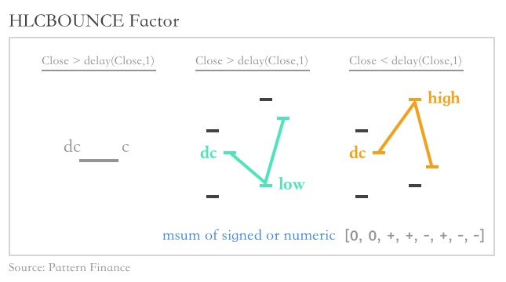
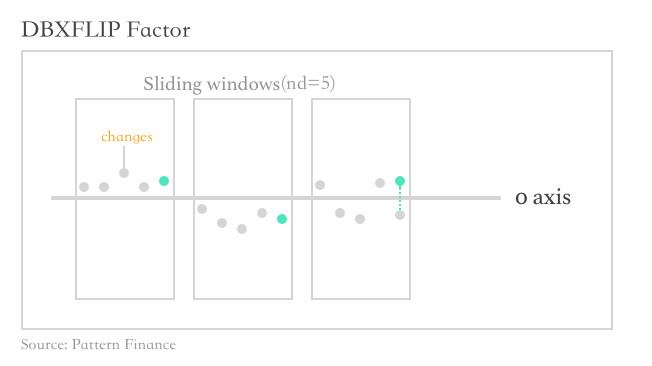

alphaTS
===================

[![BSD License][bsdlicense-button]][bsdlicense]
[![Code of Conduct][codeofconduct-button]][Code of Conduct]

[bsdlicense-button]: http://img.shields.io/badge/license-BSD-yellow.svg
[bsdlicense]: http://opensource.org/licenses/BSD-3-Clause
[codeofconduct-button]: https://img.shields.io/badge/code%20of%20conduct-contributor%20covenant-green.svg?style=flat-square
[Code of Conduct]: https://github.com/Python-Markdown/markdown/blob/master/CODE_OF_CONDUCT.md

我们在这里定义我们交易所需的所有alpha数据。我们将alphaTS表示为一个文件夹，里面包含了每一支股票以单独文件形式保存的alpha数据。

1. 使用daily数据计算的alphas

   1. gpdsLiquidity: GPDS股票大师单支股票流动性
      $$
      GPDS_t=\frac{|R_{t}|}{TR_{t}}
      $$

   2. absMom30d: 相对于30日前股票自身的动量
      $$
      MOM_t=ln(\frac{close_t}{close_{t-30}})
      $$

   3. absATR30d: 过去30日Absolute ATR波动率

   4. volSpikes3d: 放量指标
      $$
      VS_t=\frac{volume}{sma(delay(volume,1),3)}
      $$

   5. dbxOHLC: 当日单边性
      $$
      DBX_t=\frac{close_t-open_t}{(high_t-low_t)+0.001}
      $$

   6. revOpenVol10d: 过去10日的开盘价与成交量背离指标
      $$
      Corr_t=-1*correlation(open,volume,10)
      $$

   7. revVwapVol10d: 过去10日的价量背离指标
      $$
      Corr_t=-1*correlation(vwap,volume,10)
      $$

   8. revVVol10d: 过去10日的量幅背离指标
      $$
      Corr_t=-1*correlation(high/low,volume,10)
      $$

   9. gapOpening: 当日开盘缺口指标

   10. volCross_9_12_26: 成交量金叉

   11. hlcBounceNumeric6d: 过去6日反弹强度的走势(numeric)

   12. hlcBounceSigned6d: 过去6日反弹强度的走势(signed)
       

   13. v1MRChannel_2_8_v20: 均值回归通道

   14. v2Mom10d: 动量

   15. v3Mom10d: 动量

   16. cumUpChg10d: 过去10日累积上攻趋势量

   17. v1Amount: 当日资金量
      $$
      Amount_t=\frac{(close+high+low)}{3}*volume
      $$

   18. dbxflip5d: 过去5日单边性翻转
       

   19. avglines24: 多均线系统
      $$
      Avg=\frac{sma(close,3)+sma(close,6)+sma(close,12)+sma(close,24)}{4*close}
      $$

   20. v1CapFlow10d: 过去10日资金流情况

   21. goldCrossArb: 自定义走势金叉

   22. goldCrossST: 短期走势金叉

   23. goldCrossMT: 中期走势金叉

   24. goldCrossLT: 长期走势金叉

   25. v1AvgPrice: 均价
      $$
      Avg=\frac{high+low+close}{3}
      $$

   26. volStd5d: 过去5日成交量标准差

   27. trStd5d: 过去5日换手率标准差

   28. revNewHigh_20_2: 新高反转

   29. mxr_100_3_5: 回调或抄底买入

   30. v2MRChannel_20_10_1: 均值回归通道

   31. osline_0_0_5: 超卖反弹

   32. revVolPrice: 量价背离
      $$
      sign(delta(volume, 1)) * (-1 * delta(close, 1))
      $$

       

2. 使用daily cross-sectional数据计算的alphas

   1. 随机排名

      ​

3. 使用Intraday数据计算的daily alphas

   1. 日内收益率偏度

